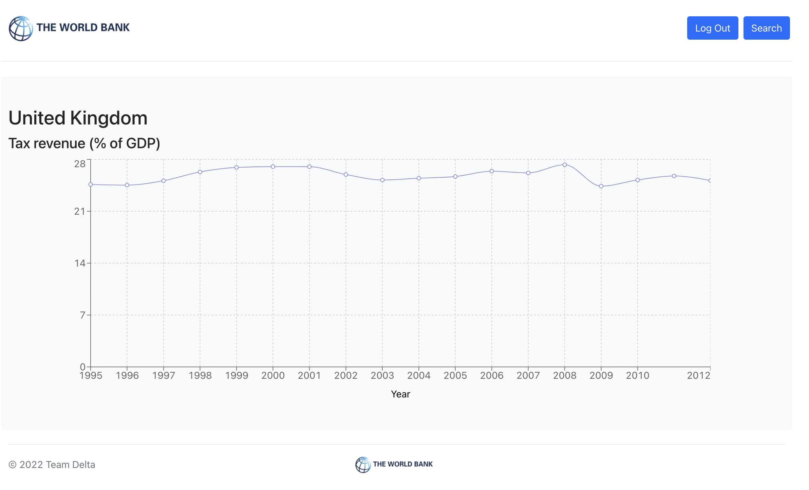

# WorldBankFrontend

## Introduction

The frontend repository for the team Delta website displaying The World Bank data in a visually accessible format.

## Using the website

### Creating an account / logging in

A user can create an account by selecting the create account button. Once created, the user will remain signed in for 24 hours.

### Using the search bar

A user can select:

- A single country and indicator
  
- A single country, indicator and year
- Two countries and an indicator
- Two countries, an indicator and a year

Where no year is specified, the user will be able to view the data for all years available as a graph.

### Viewing results

When viewing results, the user has the option to input another search or to log out with buttons in the top right hand corner.

## Team Delta:

Project manager: Engineer Oliver Case-Green 
Systems architect: Engineer Harry Davis 
Quality assurance: Engineer Tamoor Waheed 
